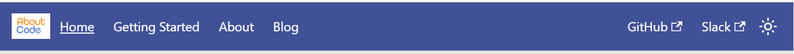

# www.aboutcode.org

## Overview
This is the repository for the AboutCode public website. It is based on [Docusaurus](https://docusaurus.io/docs).
This website is currently in a Beta phase with a primary focus on content over format.

We value contributions from members of the community.  You can always suggest a new feature or a change to some existing element of the website by opening an issue and, if you're ready, a PR.
- The normal process for suggesting changes is to create an issue to explain the change before creating a pull request.
   - When you create an issue for the website please prefix the issue title with "WWW" and apply the label "website".
   - The "WWW" prefix in the title is to make it easy to distinguish an issue from "DOC" issues which are about more general documentation and "POST" issues which are ideas for blog posts.
   - The "website" label is to ensure that your issue and activity around it will show up in the AboutCode Slack channel "www-aboutcode-org".
- If you do submit a pull request (PR):
   - DO not use CoPilot or other AI tools to create the PR or its content. AboutCode does not accept AI-generated PRs and dealing with them takes away valuable time for our core work.
   - Do not include changes to the current project configuration - e.g., do not include an updated package-lock.json or yarn.lock with a PR.
   - Do not add new dependencies with your PR.
- It is OK to directly submit a PR to fix typos and other minor corrections.

The latest website is published at: https://aboutcode-org.github.io/www.aboutcode.org/.

## Simplified website structure
This section documents the website structure which necessarily follows a Docusaurus template and configuration. There are two primary ways to update the website:
- Many elements of the website -- including the navbar, the footer, the sidebars, the landing page, and the blog's authors.yml and tags.yml files -- are complex to update. In most cases you should create an issue and the core team will need to create the PR or help you create one.
- Most of the primary website content (including the blog posts) is composed of markdown files which are much easier to update. For these pages you will see an "Edit this page" link at the bottom of the text. You can use this link to go directly to the corresponding markdown file in this repository where you can use the GitHub UI to create a new branch and PR or you can create a branch and PR locally in your preferred GitHub tools.




Looking at the links in the website's navbar (defined in `../website/docusaurus.config.js`) ^:

- **AboutCode logo**
  - **link**: website Home (landing page)

- **Home**
  - **link**: website landing page
  - **edit**: submit an issue
  - **structure**: website landing page is defined with a series of nested index.js, .css and other files, e.g.:
    - *primary index.js*: `../website/src/pages/index.js`
        - *HomepageHeader*: `../website/src/components/HomepageHeader/index.js`
        - *HomepageContent*: `../website/src/components/HomepageContent/index.js`
            - *HomeIntro*: `../website/src/components/HomepageContent/HomeIntro.mdx`
            - *ProjectOverview*: `../website/src/components/HomepageContent/ProjectOverview.md`
            - *ProjectGridTemplate*: `../website/src/components/ProjectGridTemplate/index.js`
                - *Application projects*: `../website/src/data/projects-application.json`
                - *ScanCode projects*: `../website/src/data/projects-scancode.json`
                - *Package-URL projects*: `../website/src/data/projects-package-url.json`
                - *Inspectors*: `../website/src/data/projects-inspectors.json`
                - *Libraries*: `../website/src/data/projects-libraries.json`
            - *Supporters*: `../website/src/components/HomepageContent/Supporters.md`

- **Getting Started**
  - **link**: a group of .md pages organized around a sidebar nav
  - **edit**: each .md has an `Edit this page` link in the lower-left corner of the page
  - **structure**:
    - *Getting started*: `../website/docs/getting_started/getting_started-getting-started.md`
    - *Software identification*: `../website/docs/getting_started/getting_started-software-identification.md`
    - *Security*: `../website/docs/getting_started/getting_started-security.md`
    - *Compliance*: `../website/docs/getting_started/getting_started-compliance.md`
    - *CRAVEX*: `../website/docs/getting_started/getting_started-cravex.md`

- **About**
  - **link**: a group of .md pages organized around a sidebar nav
  - **edit**: each .md has an `Edit this page` link in the lower-left corner of the page
  - **structure**:
    - *Contribute*: `../website/docs/about/about-contribute.md`
    - *Events*: `../website/docs/about/about-events.md`
    - *Meetings*: `../website/docs/about/about-meetings.md`
    - *News*: `../website/docs/about/about-news.md`
    - *Releases*: `../website/docs/about/about-releases.md`

- **Blog**
  - **link**: a group of .md pages organized around an auto-generated blog sidebar nav
  - **edit**: each post now has an `Edit this page` link in the lower-left corner of the page
  - **structure** (excerpt):
    ```
    ../website/blog
    ├── atom-chen-aboutcode
    │   ├── 2025-02-04-atom-chen-aboutcode.md
    │   └── atom_grey-1024x683.png
    ├── copyleft-licensed-software-java-app
    │   ├── 2021-01-31-copyleft-licensed-software-java-app.md
    │   └── java_copyleft_license.png
    ├── curated-licenses-public-database-scancode-licensedb
    │   ├── 2026-01-29-scancode-licensedb.md
    │   ├── ScanCode-LicenseDB-1536x1085.png
    │   ├── ScanCode-LicenseDB-2026-01.png
    │   └── scancode-db-blog.png
    ├── non-vulnerable-dependency-resolution
    . . .
    ├── authors.yml
    ├── tags.yml
    ```

- **GitHub**
  - **link**: https://github.com/aboutcode-org/www.aboutcode.org
  - **edit**: submit an issue
  - **structure**: a link in `../website/docusaurus.config.js`

- **Slack**
  - **link**: https://aboutcode-org.slack.com/join/shared_invite/zt-1paqwxccw-IuafuiAvYJFkTqGaZsC1og#/shared-invite/email
  - **edit**: submit an issue
  - **structure**: a link in `../website/docusaurus.config.js`

- **light/dark toggle**
  - provided by default in `classic` theme
