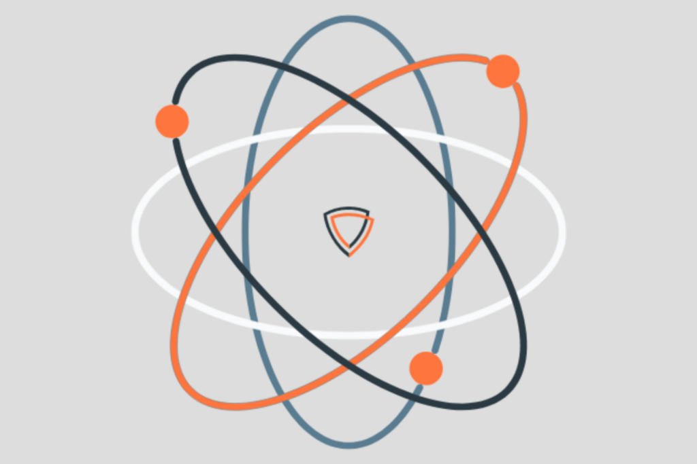

[atom](https://github.com/AppThreat/atom) and [chen](https://github.com/AppThreat/chen),
two open source tools for high-quality code analysis built by the
[AppThreat](https://www.appthreat.com/) team, are now part of the
non-profit [AboutCode](https://aboutcode.org/)
organization committed to making open source easier and safer
to use by building critical open source tools for Software Composition
Analysis (SCA) and beyond.

“AppThreat started with the simple mission to make high-quality code analysis
and security tools for everyone,” says [Prabhu Subramanian](https://github.com/prabhu),
lead maintainer of atom and chen, founder of AppThreat, and creator of other
open source  supply chain security tools like [OWASP CycloneDX Generator
(cdxgen)](https://github.com/CycloneDX/cdxgen),
[OWASP blint](https://github.com/owasp-dep-scan/blint), and
 [OWASP depscan](https://owasp.org/www-project-dep-scan/).

While working on a different problem, Prabhu uncovered a lack of high-quality
code hierarchy analysis libraries and CLI tools. atom and chen were built as
open source tools to identify likely adversary entry points to improve threat
modeling, vulnerability management, and risk mitigation. Precisely knowing
when, where, and how a given library is used in an application or service
empowers developers to better understand risks and secure their work.

chen, or Code Hierarchy Exploration Net, is an advanced exploration toolkit
for your application source code analysis to parse and extract code property
graphs.

Powered by the chen library, atom is a novel intermediate representation for
applications and a standalone tool. The intermediate representation (a network
with nodes and links) is optimized for operations typically used for
application analytics and machine learning, including slicing and vectoring.

“As our projects grew in usage and significance, we felt the need to donate
these projects to an open source organization committed to the original
AppThreat mission,” says Prabhu. “AboutCode is that organization.”

AboutCode is a registered non-profit organization that supports the
development and maintenance of the AboutCode stack of open source tools and
open data for SCA, including the industry-leading ScanCode, VulnerableCode,
and DejaCode projects. AboutCode believes that good open source tools and
open data help you use open source securely and efficiently.

With planned tighter integrations with the AboutCode stack, atom and chen will
provide an even more comprehensive open source solution for the practical
management of open source and security compliance. This includes advanced code
reachability analysis, more efficient triage of vulnerabilities based on true
reachability, and deep analysis of call graphs to find where vulnerable code
is used.

For supply chain analysis, atom can generate evidence of external library
usage, including the flow of data. OWASP cdxgen uses atom to improve the
precision and comprehensiveness of the generated CycloneDX SBOM document.

For vulnerability analysis, atom describes vulnerabilities with evidence of
affected symbols, call paths, and data flows to enable variant and
reachability analysis at scale.

“The next frontier in vulnerability management is deep vulnerable code
reachability analysis and taint analysis to discover new vulnerabilities,”
says AboutCode lead maintainer Philippe Ombredanne. “atom and chen are the
fundamental blocks to enable the construction of a FOSS solution to better
triage vulnerabilities and avoid vulnerability fatigue.”

Building upon atom and chen joining, AboutCode will adopt an open governance
model, drawing from best practices established by other organizations
committed to open source software, prioritizing transparency, inclusivity, and
 community-driven development. A technical advisory group (TAG) will be formed
  to ensure project development addresses the needs of the wider community.

Want to get involved? Join the AboutCode [Slack](https://join.slack.com/t/aboutcode-org/shared_invite/zt-1paqwxccw-IuafuiAvYJFkTqGaZsC1og)
or [Gitter](https://app.gitter.im/#/room/#aboutcode-org_discuss:gitter.im)
to chat with the community.
