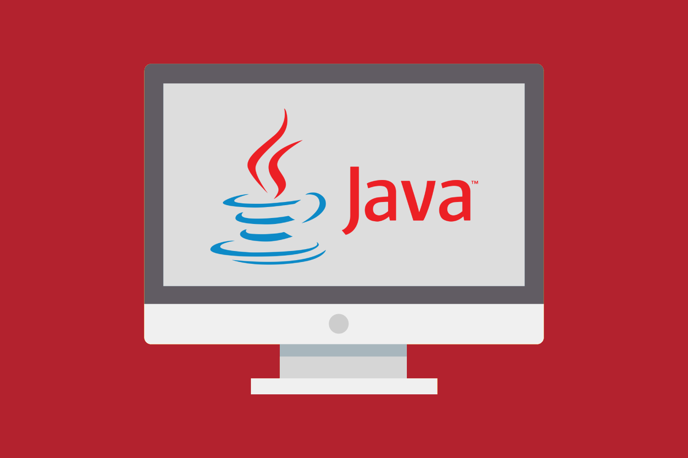

Key considerations while using Copyleft-licensed software components in a Java application.

This document explains some key considerations for the use of Copyleft-licensed software components in a Java application in two contexts:

- Execution of the Java code in a shared JVM.
- Combining class files in a shared executable JAR – and by extension in a Combined JAR (e.g. uber-jar or fat jar).

For this document, “JAR” refers specifically to an executable Java library that is a collection of `.class` files packaged into a file with the `.jar` extension; it does not refer to the use of a `.jar` file as an archive file only (such as for packaging source files for a Java library).

The purpose of this document is to present a “conservative” interpretation of what linking, or interaction may mean in the Java context. It is not based on any particular product or application and we are not aware of any specific license compliance enforcement actions in this area.

## “Strong” Copyleft-licensed Components

The execution of any software component licensed under GPL (or another “strong” Copyleft license such as AGPL, SleepyCat, etc.) in a JVM effectively links that component with all other software components in that JVM process and therefore those other components become subject to GPL license obligations including redistribution of source code.

The net impact of this interaction inside a JVM is that you should not Deploy any GPL-licensed code in a commercial Java-based product, unless that GPL-licensed code is executed in a separate JVM. This use case is possible, but quite rare in practice.

In such rare cases, the GPL-licensed component should be used as-is and un-modified.

If a modification is absolutely required, the purpose of the modification must not be to expose some privileged way to communicate with this library from proprietary code such as exposing a socket interface or other API for the sole benefit of avoiding a direct call to the Copyleft-licensed library.

Such modifications would be considered as essentially similar to running the Copyleft-licensed library in the same JVM process and making direct calls so that the Copyleft obligation would still apply.

## “Limited” Copyleft-licensed Components

Any code included within a JAR can be considered to be statically linked with any other code in that JAR, even though strictly-speaking there is no such concept of “static linking” in Java technology.

The primary logic here is that a JAR  is an executable program and all of the files inside it interact within that context.

Clearly there are many programming-level differences between:

1. the process of compiling and linking C/C++ source files into an executable program and
2. the process of converting .java or other source files (such as Scala) into `.class` files and packaging them into a JAR.

But there are more similarities than differences. The net impact of this interaction inside a JAR is that you should not deploy any Copyleft-licensed code in a JAR in combination with any proprietary code.

The impact of software interaction of `.class` files within a JAR varies according to the specific subtype of limited Copyleft license.  There are three primary subtypes to consider:

1. LGPL
2. GPL with Classpath Exception
3. “Public” or file-based licenses (CDDL, EPL, MPL)

## 1) LGPL

The LGPL version 2 and version 3 licenses are quite different, but in both cases there are specific terms and conditions related to software interaction and these provide the strongest case that combining `.class` files in an executable `.jar` is a form of static linking.

## 2) GPL with Classpath Exception

This license permits static linking of “independent modules”, but it may be hard to argue that `.class` files combined into a single JAR are independent.

## 3) “Public” or file-based licenses (CDDL, EPL, MPL)

The Copyleft impact from these licenses are primarily limited to the file level so this is the best case to argue that you can combine class files into one JAR without Copyleft impact.

For a component licensed under any of the Limited Copyleft licenses, you do have the option to dynamically link separate libraries (JARs) within a JVM. This is different from GPL-licensed code, as described above, because you can dynamically link libraries under a Limited Copyleft license inside a JVM without a Copyleft impact on other libraries.

The recommended best practice is to Deploy any Java library under a Limited Copyleft license as a separate “dynamic” library as provisioned from the original OSS project.  This is the best way to avoid Copyleft impact.

## Combined JARs: uber-jars, mega-jars and fat-jars

Java code is typically packaged and redistributed as pre-compiled `.class` files assembled in one or more JAR libraries. Open source Java libraries are commonly downloaded at build time from a repository such as Maven (either a private or the Maven Central public repository).

The process of creating a Combined JAR is to combine the `.class` files from all of the third-party dependency JARs together with proprietary-licensed `.class` files in a single JAR. This larger Combined JAR mixes open source (and possibly Copyleft-licensed code) and proprietary code in a single JAR.

Creating larger Combined JARs is typically automated as part of a product build. Maven-based build plugins and tools include Maven Shade, one-jar, fat jar and others.

In most cases, this is an addition to the build that is easily reversed to revert to a multi-jar deployment approach. The technical purpose of building a Combined JAR may be to:

- Simplify the deployment or configuration of some larger Java applications by reducing the number of `.jar` libraries to be deployed.
- Simplify runtime configuration. In particular the Java class paths do not need to be configured to reference the dependencies since they are all contained in a single executable library.
- Accelerate initial loading of the application in the JVM where startup time is critical for the application. This acceleration is likely to be minimal.

In addition to the Copyleft interaction issues outlined above, some other disadvantages of using Combined JARs are:

- In the process of creating a Combined JAR, some common files with the same name and path (such as NOTICE, LICENSE) may be overwritten in a Combined JAR. Only one copy of each such file will exist in the Combined JAR. The terms of most open source licenses do not permit you to remove license or notice files.
- The repackaging of un-modified JARs in a Combined JAR could be considered to be a modification. Most Copyleft licenses require you  to track and document changes so this repackaging may require additional documentation work for the product team.
- Tracing the package-version of an individual third-party component included in a Combined JAR may be difficult, which in turn may make it difficult to comply with Copyleft license conditions that require an offer to redistribute package-version-specific source code.
- When updating software, the entire Combined JAR will need to be rebuilt even if most individual third-party packages are unchanged. In particular if a single third-party component JAR needs to be updated for a vulnerability, bug or new feature fix, then the whole Combined JAR need to be redistributed to customers.
- If several larger Combined JARs are created in a product, the resulting size of the executables may be larger, as the contents of every shared third-party JAR will be duplicated in each Combined JAR instead of being shared across modules. Thus, a Combined JAR can impede the possibility and flexibility of Java library reuse.

In general, Combined JARs are best suited for Deployment of Java applications in an internal system/IT- or SaaS-only use case where some of their benefits are measurable and there are fewer issues related to license compliance and Copyleft-licensed component interaction.

When used in a commercial product that is distributed in any way, the issues attached to larger combined JARs usually outweigh any technical benefits that they may offer.
