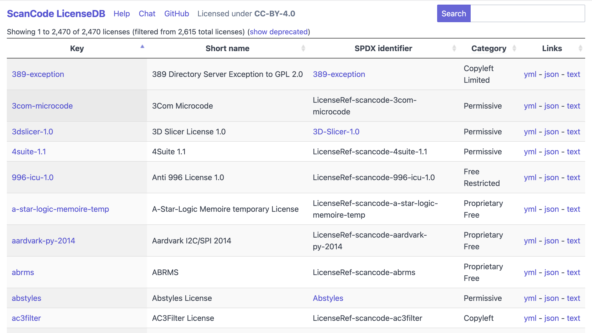

The ScanCode LicenseDB is all about identifying a wide variety of licenses that are actually found in software.

New software licenses appear constantly (like mushrooms popping out of the ground after a heavy rain) and old nearly-forgotten ones are rediscovered when someone [scans a codebase](https://www.nexb.com/scancode/) that incorporates legacy code (like finding rare medieval manuscripts in the back shelves of a library). The [ScanCode LicenseDB](https://scancode-licensedb.aboutcode.org/) precisely identifies and organizes licenses and their metadata so that multiple members of the software community can understand exactly which licenses are being referenced in project documentation.

If you have seen a license notice, passed it on to your legal team for scrutiny, and completed that review, then you probably do not want to repeat that process over and over again.

With over 2,000 licenses, ScanCode LicenseDB is arguably the largest free list of curated software licenses available on the internet, and an essential reference license resource for license compliance and SBOMs. ScanCode LicenseDB is available as a website, a JSON or YAML API, and a git repository making it easy to reuse and integrate in tools that need a database of reference software licenses.

Here are some key points about the ScanCode LicenseDB:

- Is a list of 2,470 licenses recognized by scancode-toolkit as of 2026-01-29
- Identifies each license by the license key defined in scancode-toolkit
- Provides an SPDX Identifier (with link) to every license and exception on the SPDX License List, and a “Licenseref” identifier for every license and exception not on the SPDX License List.
- Provides license texts in plain text formats.
- Provides license texts and metadata in yml and json.
- Freely accessible via [API](https://scancode-licensedb.aboutcode.org/help.html#api)
- Data licensed under CC-BY-4.0
- Community supported on [GitHub](https://github.com/nexB/scancode-licensedb).

And below are some frequently asked questions about the ScanCode LicenseDB.

**Q: What are the inclusion criteria for a license to be in the ScanCode LicenseDB?**

A: The only requirements are a text and a usage in existing code. The ScanCode LicenseDB includes multiple categories of licenses, not just open source: permissive, copyleft, commercial, proprietary free, source-available, etc. More information on license categories is available here: https://scancode-licensedb.aboutcode.org/help.html#license-categories

**Q: Does the ScanCode LicenseDB compete with other license lists, such as the SPDX license list?**

A: No. The ScanCode LicenseDB is intended to **supplement** other license lists. When new licenses are discovered by scancode-toolkit or the software community, they are added to the list with references to other lists whenever possible.

**Q: What is the process for adding or correcting licenses in the ScanCode LicenseDB?**

A: License curation is primarily a task of the active participants in [AboutCode.org](https://www.aboutcode.org/), but any member of the software community is welcome to log and respond to issues at https://github.com/nexB/scancode-licensedb/issues. See https://scancode-licensedb.aboutcode.org/help.html#support for more details.

**Q: Is a license in the ScanCode LicenseDB “approved” or “recommended for use”?**

A: The ScanCode LicenseDB is all about identifying the wide variety of licenses that are actually found in software. There is no attempt to approve or disapprove of license terms, and there is no attempt to correct poorly written licenses. The only license interpretation provided is a license category, which represents the best judgment of the license curators.

**Q: How are licenses discovered (detected) by scancode-toolkit?**

A: For license detection, ScanCode uses a (large) number of license texts and license detection ‘rules’ that are compiled in a search index. When scanning, the text of the target file is extracted and used to query the license search index and find license matches.

For copyright detection, ScanCode uses a grammar that defines the most common and less common forms of copyright statements. When scanning, the target file text is extracted and ‘parsed’ with this grammar to extract copyright statements.

More detailed information is available at https://scancode-toolkit.readthedocs.io/en/stable/explanation/scancode-license-detection.html#scancode-license-detection.

**Q: How can I get help or contribute to ScanCode LicenseDB?**

A: You can chat with the AboutCode community on [Gitter](https://app.gitter.im/#/room/#aboutcode-org_discuss:gitter.im), or report issues or ask questions at https://github.com/nexB/scancode-licensedb/issues.
