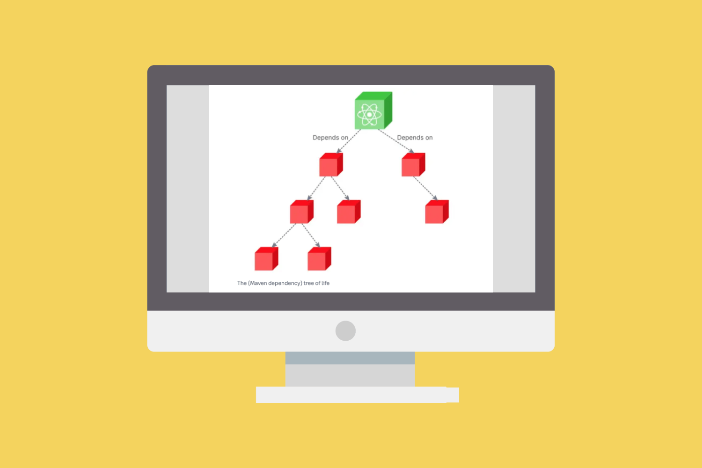
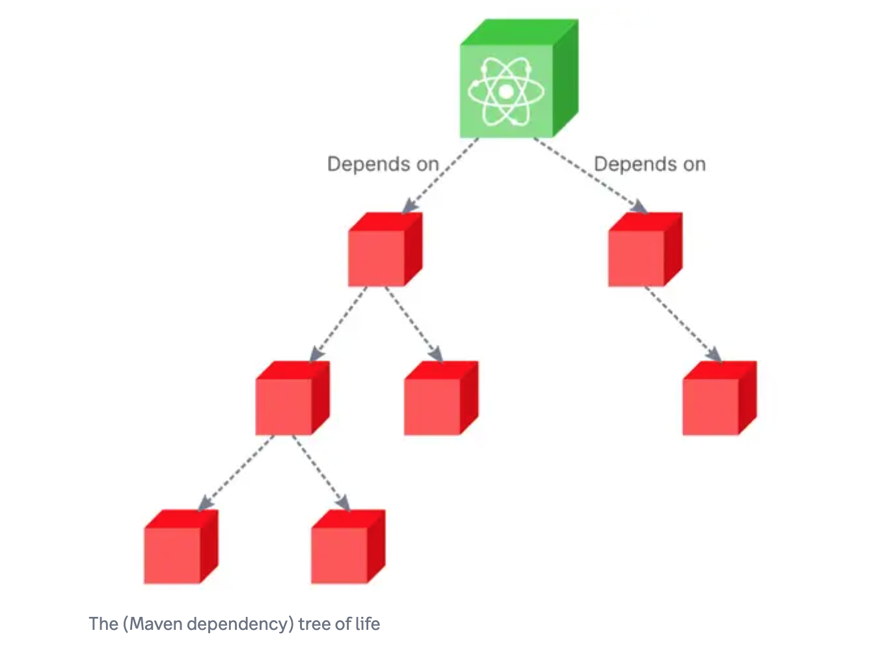

Dependencies may come with vulnerabilities that can be exploited by attackers.

Dependency resolution is the process of identifying and installing the required software packages to ensure that the software being developed runs smoothly. However, these dependencies may come with vulnerabilities that can be exploited by attackers.

Until now, these contexts have been considered as separate domains:

- Package management tools resolve the version expression of the dependent package of a package to resolved versions in order to install the selected versions.

- Security tools check if resolved package versions are affected by known vulnerabilities (even when integrated in a package management tool)

As a result, the typical approach to get a non-vulnerable dependency tree is:

1. Resolve a dependency tree and install the resolved package versions.

2. For each resolved dependent package version, translate the identifiers and look in a vulnerability or bug database to determine if a version is affected by a vulnerability and which package version fixes this vulnerability, if any.

3. Update the vulnerable versions with fixing versions.

4. Repeat step 1 until you have exhausted all possibilities. Stop on conflicts if a resolution is not possible when considering functional requirements and vulnerability fixing versions.

That approach is complex, tedious and time-consuming. It also suggests non-vulnerable versions without consideration for the functional dependency requirements necessary when reconsidering each dependency separately. This is a waste of time and effort as the non-vulnerable suggestion may not satisfy the functional constraints. Stated otherwise, the result may be a non-vulnerable package tree where packages do not work together and do not satisfy functional requirements, e.g., this results in potentially non-functional software.

Here at nexB, we propose a new method and process to resolve software package vulnerable version ranges and dependency version constraints at the same time. This enables developers to obtain a resolved software package version tree matching the blended constraints of functional and vulnerability requirements in order to provide non-vulnerable and up-to-date software code.

The process would go through these typical steps:

1. Given an input software package, collect its direct functional dependency requirements from its manifests and/or lockfiles. Optionally, parse these requirements to normalize them as [Package-URLs](https://github.com/package-url) and [Version Range Specs](https://github.com/nexB/univers).

2. Fetch the known package versions set from the ecosystem package registry.

3. Collect known affected package versions ranges and fixed ranges from a vulnerability database or service using the identifiers from step 1.

4. Combine the version ranges of each dependency from steps 1 and 3 in a single new version range and for each dependent package.

5. Feed the combined ranges from step 4 as input to the dependency resolver. Obtain resolved dependencies that satisfies both constraints. The resolver may further request additional versions and ranges using the processes from steps 1 through 4 when new dependent packages are collected during the resolution process.

6. Obtain and output the results of the combined resolution of step 5. Report conflicts and optionally suggest conflict resolutions.

With this new process, we get a resolved package dependency tree with versions that satisfy both functional and vulnerability or bug constraints in a single resolution pass.

It’s worth noting that non-vulnerable dependency resolution is an ongoing process. Developers should regularly monitor their software packages for any newly discovered vulnerabilities and update their packages accordingly. This is particularly important when new vulnerabilities are discovered in commonly used packages, as these can have a significant impact on a wide range of software applications.

In conclusion, non-vulnerable dependency resolution is an essential practice that should be adopted by all developers. By selecting software packages that are free from known vulnerabilities, developers can significantly reduce the risk of security breaches in their software applications. Additionally, regularly monitoring and updating packages, as well as ensuring that packages are obtained from trusted sources, can further enhance the security of software development.

To understand this topic in more detail, read this defensive publication on [Non-Vulnerable Dependency Resolution](https://www.tdcommons.org/dpubs_series/5224/) from the Technical Disclosure Commons.
