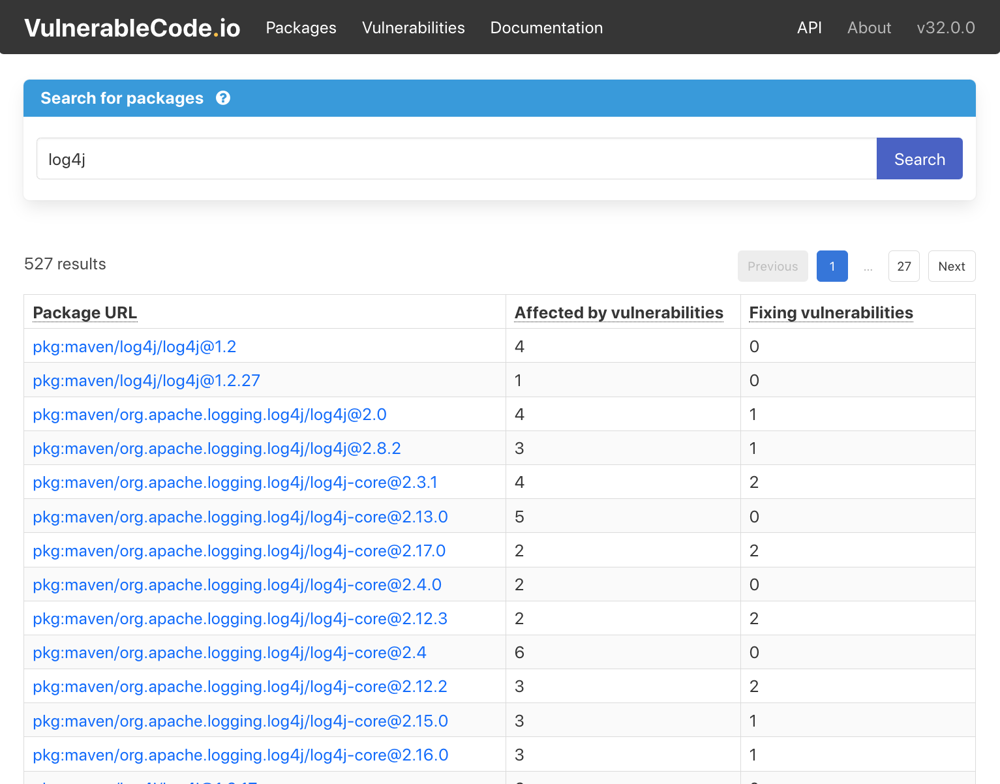

Accurately identify third-party software packages with PURL.

If you need to generate (or consume) Software Bill of Materials (SBOMs), then you need a standardized way to communicate information about what components are in your software.

If you’re using or building applications, you need tools to determine if there are any known security issues with open source and third-party components.

If you’re building tools for Software Composition Analysis (SCA) like analyzing the origin, license, security, and quality of the code across different ecosystems. You need a simple way to identify the packages used.

Package URL (PURL) is a new open source standard to convey accurate identifications of the third-party software packages that were used.

[https://xkcd.com/927/](https://xkcd.com/927/)

A universal identifier like PURL provides both internal developers and external users with direct access to key information about those packages like vulnerabilities and licenses. PURL reduces friction by providing continuity across tools, processes, development environments, and ecosystems.

It’s not complex. The idea behind PURL was to find a simple way to identify a software package based on its name.  Just by looking at the code, you can determine the Package URLs of the open source packages that you are using. PURLs are defined by the intrinsic nature of the software you observe, and that makes the difference.

A car is a good analogy for demonstrating the superpower of easily identifying something just by looking at it. You can determine the make and model of a car by observing it. You can then uniquely identify by looking at the license plate.

In contrast, identifiers previously used for software packages are complicated. In the world of security, the [National Vulnerability Database](https://nvd.nist.gov/) (NVD) uses an identifier for software packages called Common Platform Enumeration (CPE).

Extending the car analogy, identifying the CPE is like trying to find the internal model number from the manufacturer: you need to have access to extra information that are not obvious and not readily available by watching the car. Using CPEs to query the NVD requires prior knowledge of this extra information and arbitrary assigned identifiers, adding complexity with an additional step.

Package URLs, in comparison, are simple and easy for developers to know what the package actually is! By looking at the car, we can easily observe the make, model, color, condition, and the license plate number, which we can use to universally identify the car more efficiently. Finding the internal manufacturer part number with a central authority to identify it is too cumbersome. PURL brings us simplicity.

PURL can be extremely helpful for organizations mitigating high-profile security issues related to open source package vulnerabilities. More information is usually required to fix these vulnerabilities than what you can discover by looking at the code. The conjunction of several high-profile security issues heightened the need to figure out what third-party software packages are included in many software products.

For example, there was that major security bug with [Log4j](https://logging.apache.org/log4j/), which was really in Log4j version 1.2.17. How can you know if you use Log4j v1.2.17 when there’s a security issue? It’s powerful to know just by looking at the code. But if you need to know that it’s called apache:log4j, then it’s much harder and this is required to query NVD.

PURL removes the friction to search complex auto-generated values in databases. This makes PURL even more useful for the larger software development community.

## How PURL was made

The origins of PURL can be traced very specifically to 2017 when we needed a new way to identify packages in ScanCode Toolkit.

As part of ScanCode v3, we designed parsers for package manifests, like a Maven POM, a Python setup.py, and a npm package.json. But, it was incredibly difficult to quickly identify these packages across ecosystems. We considered different schemas for different environments, but quickly understood that would be way too complicated. After looking at existing options in different open source communities, we discovered a Google project called [Grafeas](https://grafeas.io/).

Grafeas defined something promising and wonderfully simple called resource URLs, derived from and contributed by [JFrog](https://jfrog.com/) and their product [JFROG XRAY](https://jfrog.com/xray/). In a resource URL, a node package would be identified as npm://name@version. This is quite similar to URL nomenclature, but modifying the prefix to identify the development environment and then, essentially a name:version. Grafeas was already in use in various places, so we created an issue describing a few details to work out and pinged [R2wenD2](https://github.com/R2wenD2), who was actively working on the project.

I also reached out to the [OSS Review Toolkit (ORT)](https://github.com/oss-review-toolkit/ort) project to discuss best practices for identifying packages across ecosystems related to AboutCode data specs. At that time, we used a system with a name, namespace, and version for some packages, based on the resource URLs in Grafeas. But, we still needed a common syntax to easily identify these packages in and across different ecosystems.

Open source projects like Grafeas, [Libraries.io](https://libraries.io/), Fabric8 from RedHat, and several others were all doing similar things, but none solved this issue. I cherry-picked the best components of each, and built the first version of Package URL in late October 2017.

As part of nexB’s core principle of FOSS for FOSS, we moved PURL to a new, separate organization on GitHub to better collect effective feedback and share ownership. We invited every key contributor as a co-maintainer/co-owner, including R2wenD2 from Google, [Sebastian Schubert](https://github.com/sschuberth) from ORT, and later on [Steve Springett](https://github.com/stevespringett) from [CycloneDX](https://cyclonedx.org/), who was one of PURL’s early adopters and for which, the spec was key.

Relinquishing exclusive control early on but maintaining a strong design direction with the key contributors was critical for the ongoing development and success of the PURL project.

With the AboutCode projects, PURL is the critical connector. Whether it’s detecting a package in [ScanCode Toolkit](https://github.com/nexB/scancode-toolkit), looking for vulnerabilities in [VulnerableCode](https://public.vulnerablecode.io/), or reporting complex scans of container images in [ScanCode.io](https://github.com/aboutcode-org/scancode.io), the output is PURLs. The input is PURLs whenever we consume a CycloneDX or SPDX SBOM. We can easily consume and exchange information extracted by PURLs from other tools. That has proved critical to the success of these open source projects.

## Casting PURL in the real world

The basic identification of packages is simple and easy. But, there are many levels of depth beyond the package name and version, including the metadata details, like the software license, that APIs can look up. This gets tricky when the metadata details are not documented effectively or the documentation is poor or messy. All this adds more complexity!

Part of the overall identification process is knowing what files were provisioned or provided by the software package – this is very important in verifying the integrity of a package. Once the package is identified and installed on the machine, then you need to ensure that it really is what it’s supposed to be.

There are all these layers, which matter when you don’t have any package manifest or structured information about the package. It’s more complex because you need to accumulate different clues to find the potential origin, like copyright and permissions, URLs, processing READMEs of semi-structured information, and eventually matching.

Matching is performing a lookup across a larger database of known packages. In modern software development, the vast majority of packages will come with a PURL and don’t need any kind of matching. Matching is the signatory technique to help when there is murkier or more difficult information.

In some cases, matching is used for Microsoft .NET and NuGet packages. Each NuGet package is a set of files, typically DLLs and executables and they may be installed and bundled together. Once this has happened, you don’t know anymore which DLLs came from which NuGet, with NuGet now being the package. It’s not easy to find just by observing the deployed binaries. It requires some matching back to each of the packages to figure out, like “Oh! This DLL came from this Microsoft NuGet, and this other DLL came from this Acrobat NuGet.” Some high level matching of whole files can be very useful to complete the identification, typically NuGet, Apache Maven, or Java environments.

Dependency resolution is being able to literally unwind the twine ball. First, you state the direct dependencies – you need this and that and this package, and this version or a version range. Next, you go for the second level of dependencies, and then, the third level, until you go all the way down.

There is a complex set of software code called “solvers” or “dependency resolvers”, that ensure the set of versions are compatible together. The input for these solvers is a set of package versions (and in some cases, package version ranges) to find all the dependencies in the complex dependency trees. Each package manager uses their own conventions and approaches to list the various constraints so there is no easy way for a unified approach to dependency resolution.

> *The AboutCode team is currently working on [VERS](https://www.youtube.com/watch?v=xx_GREcnUQM&t=715s), as a universal standard for version ranges identifiers to enable universal dependency resolution across all package managers and to express constraints across system packages and application packages.*

Dependency resolution is designed to determine which version for a given application, and then fetch this installed version. Typically, package managers – like npm, pip for Python, a bundler for Ruby or Python – perform the dependency resolution, and once they find the release of a package to install, they download, extract and install them.

Looking at software that’s already been built, there’s nothing to understand about dependency resolution that previously happened. There’s a set of packages downloaded and installed by the package management tool in real-time, so dependency resolution matters most during the development when building the software. Upstream, this can be an extremely complex and difficult process of reverse engineering the dependency resolution.

> *A new approach called [Non-vulnerable dependency resolution](/blog/non-vulnerable-dependency-resolution/) merges and combines the dependency constraints, which are functional dependencies, to avoid using packages.*

The amount of code that can be identified by PURL depends on the environment. For more general purpose software like web, backend, desktop, and mobile development, usually 95 to 99% of the code used comes from package repositories – unless you use proprietary code, of course. But for the code that has third-party open source origins, everything is easily identified by PURL.

The main difference in PURL’s efficacy is in embedded vs non-embedded software development.

Embedded systems or environments using native code like C or C++ are more complex for PURL because these embedded systems don’t typically utilize a package manager. There are some new package managers for embedded systems like Yocto and buildroot for Linux and Conan for C++.

Tools for embedded systems like Yocto for Linux or buildroot may not use PURL, but still have a strong traceable origin of the code. In other cases, the “generic” type with a download URL can be used as a qualifier. So even if they may not use PURL, there is a good enough approach that can handle these exceptions.

In general, there’s no such thing as package managers, and PURL can still be used, but it’s going to be a bit more complex to do proper identification there – which is the big difference between embedded vs. non-embedded kind of software development. With caveats also because you have tools for embedded development now such as Yocto or buildroot that may not use PURL but still have a very strongly traceable origin of where the code comes from. In other cases we can use the “generic” type with a download URL as a qualifier.  So even if they may not use PURL, there is a good enough way that you may not use them all the time but helps deal with these exceptions!

## PURL of a FOSS price

PURL makes identification easy, across tools and ecosystems. The ability to compose with other tools – and those tools being free and all available with PURL as a mostly universal identifier – means users don’t have to struggle with integrations and can choose the best-in-class tool they want to use.

PURL was originally built for Python because that’s the language of preference for ScanCode Toolkit. But the specification and libraries for PURL libraries are simple enough that there are now implementations in C#, .NET, JavaScript, Go, Java, Ruby, Swift, Python, PHP, Rust and more. We even have more than one PURL implementation in Java for instance. A list of the available implementations is available at https://github.com/package-url/.

PURL was specifically designed to not be unique to any organization’s projects. As a new open source standard, PURL helps the ecosystem of SCA tools and provides more flexibility and more options for end users to replace, exchange, and combine tools together using PURL.

As Jackie Kennedy meant to say, “PURLs are always appropriate.”
