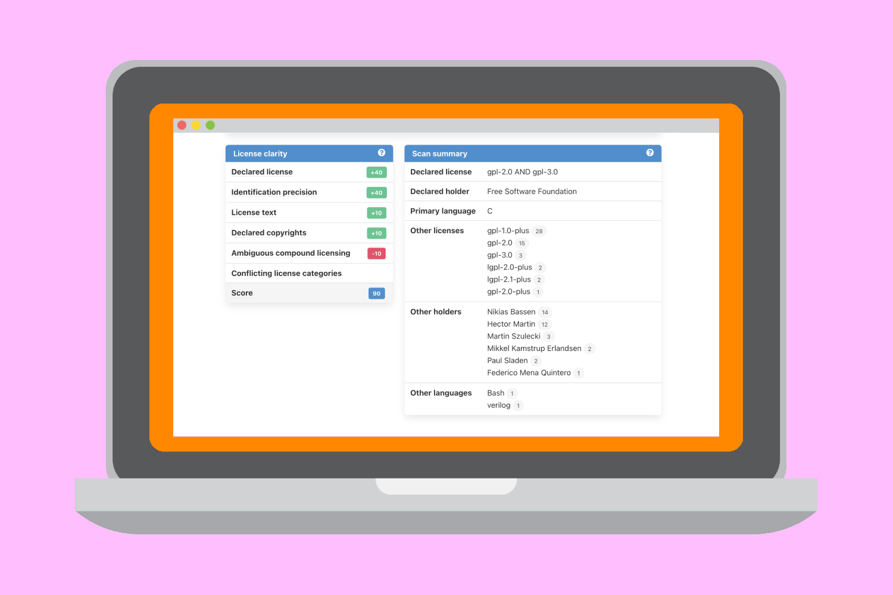
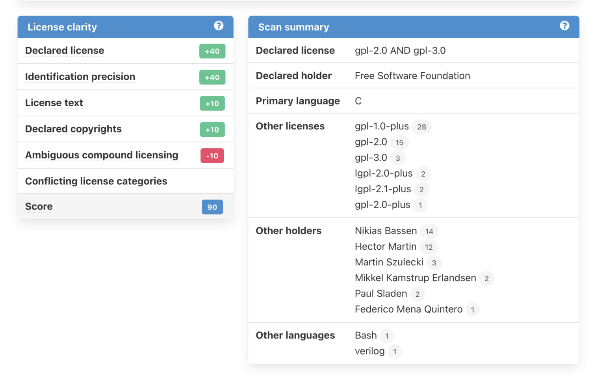
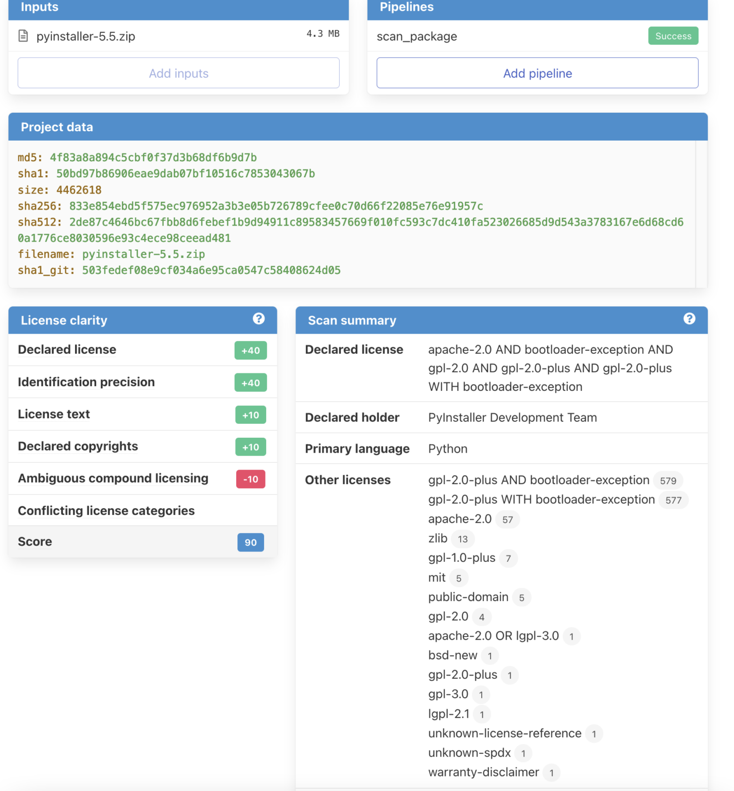
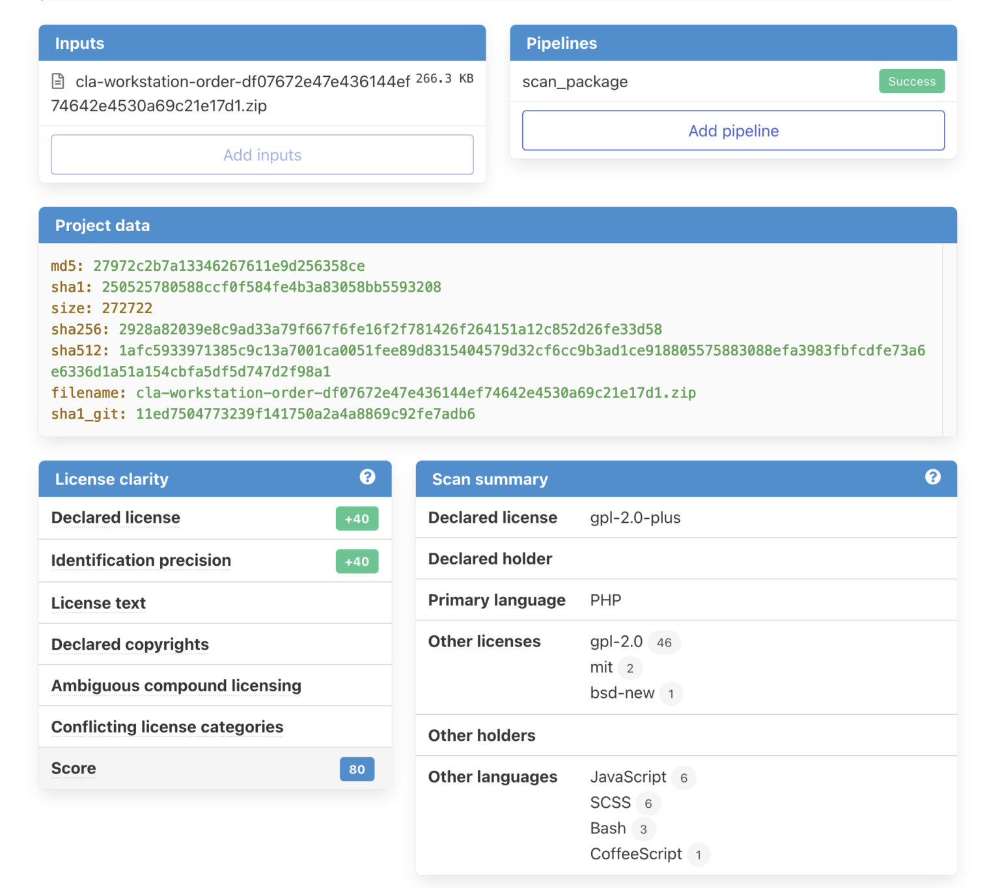

When automating SCA, License Clarity Scoring helps determine if scan results require more review.

When automating Software Composition Analysis (SCA) with a scanning tool, you need to quickly evaluate the results – especially to determine whether or not the results require a deeper investigation.

[ScanCode](https://www.nexb.com/scancode) now includes License Clarity Scoring to provide users with a confidence level regarding the automated scan results.

License Clarity is a set of criteria that indicate how clearly, comprehensively and accurately a software project has defined and communicated the licensing that applies to the project software. Note that this is not an indication of the license clarity of any software dependencies.

License Clarity Scoring in ScanCode uses that series of criteria to then rank how well a software project provides licensing information.

## Declared License Expression

`declared_license_expression` is the primary license expression as determined from the declaration(s) of the authors of the package.

The new summary fields are:

- `declared_license_expression`
- `declared_holder`
- `primary_language`
- `other_license_expressions`
- `other_holders`
- `other_languages`

Note that the term `declared_license_expression` is used equivalently for the concept of a primary license expression in order to align with community usage, such as [SPDX](http://spdx.org/).

Here is how ScanCode determines the value for a `declared_license_expression`, `primary_holder` and `primary_language` of a package when it scans a codebase:

1. Look at the root of a codebase to see if there are any package manifest files that have origin information.
2. If there is package data available, collect the license expression, holder, and package language and use that information as the `declared_license_expression`, `declared_holder`, and `primary_language`.
3. If there are multiple package manifests at the codebase root, then concatenate all of the license expressions and holders together and use those concatenated values to construct the `declared_license_expression` and `declared_holder`.
4. If there is no package data, then collect license and holder information from key files (such as `LICENSE`, `NOTICE`, `README`, `COPYING`, and `ADDITIONAL_LICENSE_INFO`). Try to find the primary license from the licenses referenced by the key files. If unable to determine a single license that is the primary, then concatenate all of the detected license expressions from key files together and use that as a conjunctive `declared_license_expression`. Concatenate all of the detected holders from key files together as the declared_holder.
5. Note that a count of how many times a license identifier occurs in a codebase does NOT necessarily identify a license that appears in the (primary) `declared_license_expression` due to the typical inclusion of multiple third-party libraries that may have varying standards for license declaration. It is possible that the `declared_license_expression` constructed by this process may not appear literally in the codebase.

As of DejaCode 4.2, you can also access the new license clarity scoring fields and summary fields in the Scan tab of the Package details user view.

When you scan a Package from [DejaCode](https://dejacode.readthedocs.io/en/latest/), you can view the Scan Results in a Scan tab on the Package details user view. DejaCode presents a selection of scan details with an emphasis on license detection. You can also download the complete Scan Results in `.json` format.

You can set the values from `declared_license_expression`, `declared_holder`, and `primary_language` to the package definition in DejaCode.

## License Clarity Scoring

The license clarity score is a value from 0-100 calculated by combining the weighted values determined for each of the scoring elements: Declared license, Identification precision, License texts, Declared copyright, Ambiguous compound licensing, and Conflicting license categories.

### Declared license (Scoring weight = 40)

When true, indicates that the software package licensing is documented at top-level or well-known locations (key files) in the software project, typically in a package manifest, `NOTICE`, `LICENSE`, `COPYING` or `README` file.

### Identification precision (Scoring weight = 40)

Identification precision indicates how well the license statement(s) of the software identify known licenses that can be designated by precise keys (identifiers) as provided in a publicly available license list, such as the ScanCode LicenseDB, the SPDX license list, the OSI license list, or a URL pointing to a specific license text in a project or organization website.

### License texts (Scoring weight = 10)

License texts are provided to support the declared license expression in files such as a package manifest, `NOTICE`, `LICENSE`, `COPYING` or `README`.

### Declared copyright (Scoring weight = 10)

When true, indicates that the software package copyright is documented at top-level or well-known locations (key files) in the software project, typically in a package manifest, `NOTICE`, `LICENSE`, `COPYING` or `README` file.

### Ambiguous compound licensing (Scoring negative weight = -10)

When true, indicates that the software has a license declaration that makes it difficult to construct a reliable license expression, such as in the case of multiple licenses where the conjunctive versus disjunctive relationship is not well defined.

### Conflicting license categories (Scoring negative weight = -20)

When true, indicates the `declared_license_expression` of the software is in the permissive category, but that other potentially conflicting categories, such as copyleft and proprietary, have been detected in lower level code.

Want to see License Clarity Scoring in action? [Download ScanCode.io](https://scancodeio.readthedocs.io/en/latest/installation.html) or [sign up for a free DejaCode account](https://public.dejacode.com/account/register/).

ScanCode provides you the license clarity score when you specify the --summary option for a scan. ScanCode.io specifies that option for you automatically.

DejaCode makes it even easier and specifies all the scan options that you need automatically when you request a package scan.
