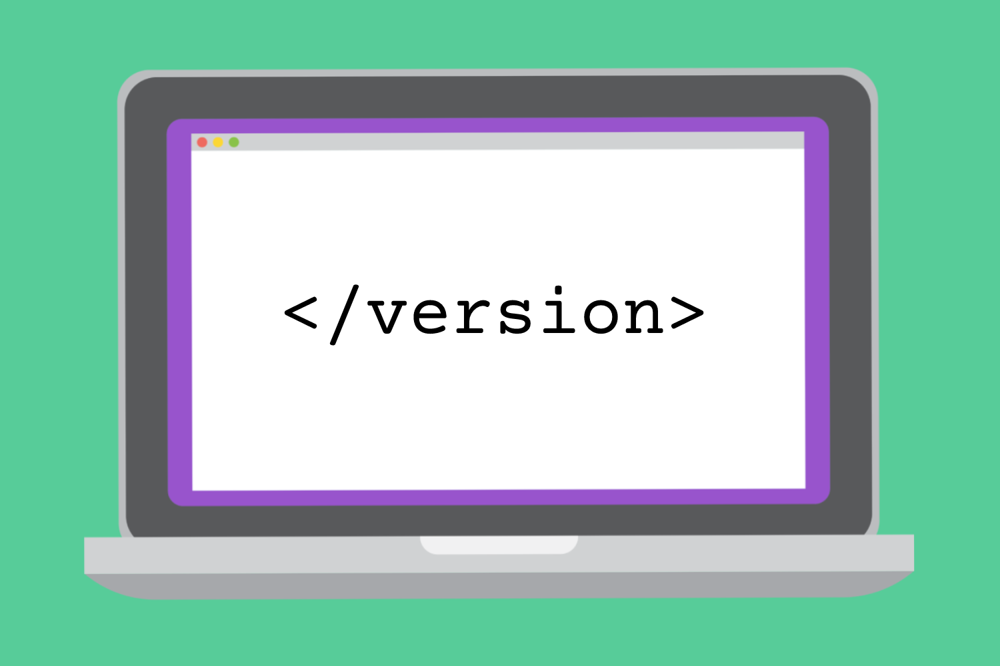

One software version control to rule them (modern software development) all?

Software projects make many decisions, but one of the most critical is deciding how to implement version control (also known as revision control, source control, or source code management). With modern software development, a versioning convention is a key tool to manage software releases and revisions. The two main approaches are calendar versioning (CalVer) and semantic versioning (SemVer), often with some alterations depending on an organization’s or project’s requirements.

For AboutCode projects, we started with SemVer, transitioned to CalVer and then migrated back to a format that mostly resembles SemVer. This blog post details the pros and cons of each version convention, along with explaining why we embarked on this version convention journey.

## The Fellowship of the Version Conventions

### CalVer

Short for calendar versioning, CalVer uses something that resembles a date as a version number. It’s popular, especially in software, to convey time in a version number. Ubuntu is a good example of using CalVer: version 12 was first released in 2012.

The idea is that you have a first segment in the version number, which is either the four-digit year or just the last two digits. Next is a month and then a day (the placement of the digits remains constant for future releases) to get the full version number where each segment is separated by a dot. With Ubuntu, they do stable releases in April, so version 22.04 is the stable release from April 2022.

### SemVer

SemVer, or semantic versioning, doesn’t convey time like CalVer. It is designed to better define the relative importance of changes in the software and its interface(s).

[SemVer.org](http://semver.org/) clearly states the structure:

> Given a version number MAJOR.MINOR.PATCH, increment the:
>
> 1. MAJOR version when you make incompatible API changes
>
> 2. MINOR version when you add functionality in a backwards compatible manner
>
> 3. PATCH version when you make backwards compatible bug fixes
>
> Additional labels for pre-release and build metadata are available as extensions to the MAJOR.MINOR.PATCH format.

Each time there’s a change in the underlying application programming interface (API), then you should change the MAJOR version. Otherwise if it’s compatible, you should change the MINOR version (the middle segment). If it’s just a bug fix, you should change the PATCH version.

In theory, SemVer looks beautiful and simple. It very simply conveys the changes in the software with three numbers. In practice, it is extremely difficult for humans to understand what is a major change that breaks the API or not. I doubt there’s any tool or whole ecosystem, like npm or Go, claiming to use SemVer that is actually true to the principles of SemVer because it’s too hard to understand if a change affects the API and whether that change is major or minor. More often than not, those version changes are misrepresenting what SemVer is designed to convey.

### OtherVer

Other approaches to version control exist beyond SemVer and CalVer.

Until version one, OpenSSL used a peculiar scheme that resembled SemVer, but with letters as a suffix. Now in version 3, they changed the scheme to be more like SemVer and dropped the letter suffix. This is difficult for users to make sense of the version when different version schemes are used over time. OpenSSL is still using its legacy version control using patches and letter suffix for pre v3 versions, making it even harder for users to understand, especially when dealing with bugs and vulnerabilities. This is problematic because there’s no upward compatibility. OpenSSL conventions are still reasonably straightforward to understand. Other projects such as nginx have more byzantine conventions where a version segment number has a different meaning if it is even or odd.

It’s important when a project is switching to a new version scheme that the project ensures and explains to its users the correct sequence of versions in a way that is as clear as possible. Note that we attempt to resolve the versioning weirdnesses of version schemes and version ranges in the [univers](https://github.com/nexB/univers) library and the upcoming [Package-URL](https://github.com/package-url) version specification for “Version Range Specification”.

Another interesting example is in the Android ecosystem. The Google Play store carries two versions for each app. One is a “version name”, which is whatever version string the author likes – this can be SemVer or CalVer or any other convention or version scheme. This version name is used only for display. The other is a version code, which has to be a single number, and must increase each time there’s a new release. Google recognizes through working with the large number of Android developers, that no versioning scheme is actually correct and could work given the scale and diversity of developers. With this version code approach, users know sequentially what is the latest release, without any bit of ambiguity and can use the “version name” for cosmetic display.

Google Play using version code for Android apps is very similar to an older approach to version control with a version control system called Subversion that was popular at the beginning of the century. Subversion used a single version number that would apply across the code tree for everyone using the same system; this single version number was incremented centrally with every code change. The Apache Software Foundation – home of the Subversion project – was one of its largest users. Each commit incrementally increased the version number, which made staying current with the latest release difficult. This was effectively one of the earliest and likely the largest public “[monorepo](https://en.wikipedia.org/wiki/Monorepo)“.

To have this kind of version numbering across a very large foundation with hundreds of projects and thousands of users [created millions of revisions](http://svn.apache.org/repos/asf/) but was not a contribution to a better coordination across projects. It was impractical and hyper centralized and most Apache projects have since switched to distributed and decentralized version control systems such as Git, but there was a value to having a simple version number that is just bumped as needed.

Subversion was the complete opposite of Git, where everything can be distributed on any computer. There is a clear benefit of being able to strictly order versions without ambiguity, which we’ve lost with distributed version control systems like Git. It’s difficult to understand the sequence of versions using commit hashes with multiple branches and their relation with time, because there may not be any relationship that’s as obvious as a single number.

One interesting pocket of Semver is the Go programming language that claims to enforce SemVer-compliance for all the third-party Go modules. In practice, the Go tools are generating pseudo-SemVer versions based on a sequence of commits in a Git repository for each of the Go libraries that you are using. The Go algorithm for doing [pseudo-SemVer versioning for modules](https://go.dev/doc/modules/version-numbers) is not straightforward. If you’re changing the API or the interface of how you call your Go function, there is no version change. Instead, you are supposed to create a new library changing its import path with a v2, but it’s not v2 as in version two – it’s more like a brand new library that shares the name with the v1.

This approach achieves some SemVer compliance by avoiding any API change, and therefore recognizes that there’s no such thing as being able to capture API changes faithfully. The only way to get compatibility between two versions is to create a new library whenever there’s a change to the signature of your Go library. Eventually, you could hope to entirely ignore versioning and use only the commit history instead of a separate versioning mechanism. The problem is that commit hashes are long (40 characters) and obscure strings that are not human-friendly (in hexadecimal).

## The Two Version Conventions: Choosing between CalVer and SemVer

Does your project feature a large or constantly-changing scope, including large systems and frameworks, like [Ubuntu](https://calver.org/#ubuntu) and [Twisted](https://calver.org/#twisted), or amorphous sets of utilities, like Boltons? Is your project time-sensitive in any way or do other external changes drive new project releases, including business requirements like Ubuntu’s focus on support schedules, security updates like certifi’s need to update certificates, or political shifts, such as pytz’s handling of time zone changes?

[CalVer.org](http://calver.org/) suggests adopting CalVer under those conditions listed above.

There is a simple value in CalVer that is you don’t have to think or strategize to pick a version number – just use the date of the release and that’s it. And it’s easier to convey a temporal change with sequential version numbers in CalVer. If you want to convey that one version is obsolete, then CalVer makes sense.

But do not overestimate the strength of the signal sent by your version number. Windows is a good example of this. Windows 95 used CalVer – 95 was for 1995. Windows 95 was used for many years afterwards, so much so that folks after 2000 probably didn’t realize that 95 really meant the last century. Same with Windows 98, these tools were still used over ten years after their release.

Recognizing SemVer and determining an API change is extremely difficult and almost impossible to accomplish truthfully. However, SemVer can be useful in systems with many dependencies. Issues like version lock (inability to upgrade packages without releasing new versions of every dependent package) or version promiscuity (assuming compatibility with more future versions than is reasonable, especially when dependencies are poorly specified) can result in a dependency hell ([SemVer.org](http://semver.org/)).

[Jacob Bolda](https://frontside.com/blog/2022-02-09-semver-or-calver-by-project-type/#:~:text=What%20is%20CalVer%3F,MINOR) from Frontside Software wrote that it’s “not a boolean choice but a spectrum whose adherence specifications you must outline depending on your project’s needs and circumstances.”

## The Return of the (mostly) SemVer

When we started AboutCode, we used SemVer, with a Python flavor that adds a few extra extensions for managing pre and post releases differently. We then realized that we had a problem when conveying the obsolescence of data that we use in ScanCode like the license DB.

Licenses change on a regular basis, both in terms of newer licenses and newer ways to talk about licenses. When we helped fix and streamline the licensing of the Linux kernel, we found close to 800 different ways to say “this file is under GPL”. Developers are creative when it comes to reporting a FOSS license!

By switching from SemVer to CalVer, we wanted to convey the idea to users that they are running a ScanCode version that’s old and probably outdated with obsolete license data. It was pretty naive for us to believe that just a version number is enough to signal users that they should upgrade. We tried to provide a way to proactively signal with a warning that they should update. This was great theoretically, except this warning code had issues and displayed a warning message even when no new version was available to upgrade, and when there was a new release it sometimes failed to display a warning.

CalVer was not working and was too weak a signal to convey obsolescence with versions, so we switched back to a SemVer version. SemVer and CalVer are compatible, so when AboutCode and ScanCode went from SemVer to CalVer and then back to mostly SemVer, it was easier (and important) to ensure that the versions sequence would stay consistent and obvious to users. During our first switch of ScanCode to CalVer, we went from version 2 to version 21. When we went back to SemVer in 2022, we decided to jump to version 30 to avoid any confusion with dates and previous versions.

The work we did around the [Package-URL](https://github.com/package-url/purl-spec) (PURL) and vers specifications and the [univers library](https://github.com/nexB/univers) project for VulnerableCode also informed our approach. Combined with PURL, the univers library is able to parse and make sense of package version ranges syntax and conventions across all ecosystems, especially for vulnerabilities, and expose them in a simple and easy to read normalized string. This is unfortunately extremely complex to achieve because of the lack of standards and the diversity of version range syntaxes. Yet this is also very useful and important to understand because we rely on versioning to understand which versions come before and after. This is key to resolving package dependencies and understanding if a version of a package falls in a vulnerable version range.

We’re not the only ones to understand the importance of this. There’s a project at the Linux Foundation under the Open Source Security Foundation (OSSF) and maintained by Google that is called the Open Source Vulnerability Database (OSV), which has very similar goals to VulnerableCode. We’re collaborating and OSV reuses some of the code from univers to better understand how all of these versions compare and fit together.

## One Ver to rule them all?

Having designed libraries and specs and built tools to handle arbitrarily complex versions and version ranges, we came to the conclusion that the only benefit of SemVer is that it’s familiar and well understood by everyone. But it is a fallacy to believe that we can faithfully implement SemVer.

This is because of [Hyrum’s Law](https://www.hyrumslaw.com/), which states:

> With a sufficient number of users of an API, it does not matter what you promise in the contract: all observable behaviors of your system will be depended on by somebody.

Hyrum’s Law means that if you have enough users, every little bug and how your tool behaves internally will eventually be considered an API or a feature by some users. What we think about APIs is not what your user may think about being an API. That applies to any interface that we may design.

 
[https://xkcd.com/1172/](https://xkcd.com/1172/)

It may be technically possible in some cases to let the system, tool, or code decide when there’s an API change, but it would be extremely complex in general as determining this requires intelligence and detailed understanding of how a library or tool behaves and may be used. This is very hard for humans and harder for machines!

Versions are necessary and useful. They carry at least one meaning, which is to state if this version came before or after a piece of code. But applying more weight to their meaning distracts from what they’re meant to convey.

Jacob Tomlinson, a software engineer at [NVIDIA](https://www.nvidia.com/), wrote a [blog post on why he sometimes regrets using CalVer](https://jacobtomlinson.dev/posts/2023/sometimes-i-regret-using-calver/):

> By releasing software that uses SemVer you are signaling to your community that you have some constraints. In my opinion, CalVer signals to your community that anything could happen at any time and that you have no interest in the effect that has on your users.

We recognize that unfortunately all the versions that pretend to carry special meaning are mostly misleading, or not true to what they’re trying to convey, whether it is date changes or API-based changes. But even if a SemVer version may be misleading, it’s very important to have such a number that humans can refer to and easily remember. There are some good reasons to implement CalVer, but for the AboutCode team, we found that a modified approach to SemVer was the best approach to display version obsolescence for our users.

With this approach, we acknowledge that any attempt to decide correctly if a new release should increase the major, minor or patch part of the SemVer version is condemned to be incorrect or misleading more often than not. Instead, we are trying to make decent guesses if a new version is major, minor or patch, but this is mostly stating that this is a big release with big changes or a smaller release. We have also introduced an “output format version” to [ScanCode Toolkit](https://github.com/nexB/scancode-toolkit) that is loosely based on SemVer and lives on its own schedule; It is based strictly on the output data structure in the JSON format; Changes to this format are simpler to evaluate as breaking the API or not, and we may be truer to SemVer spirit in this case.
